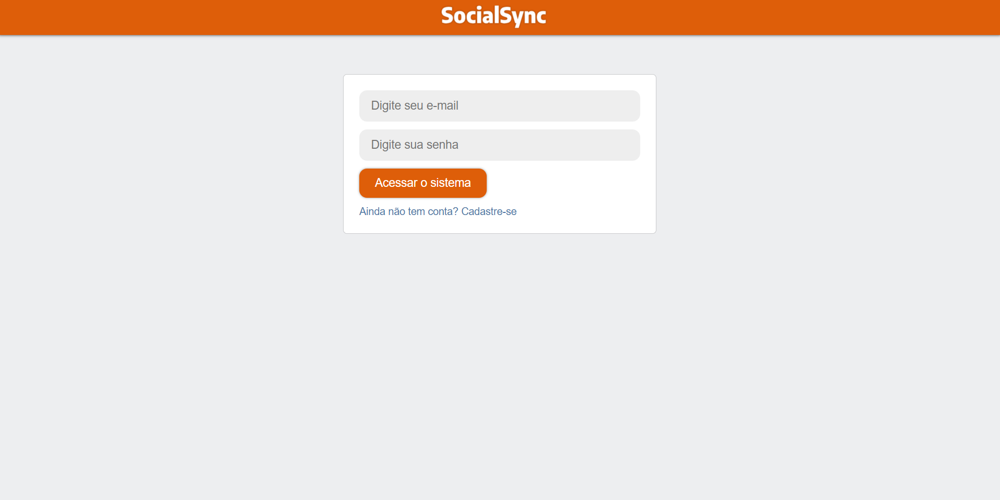
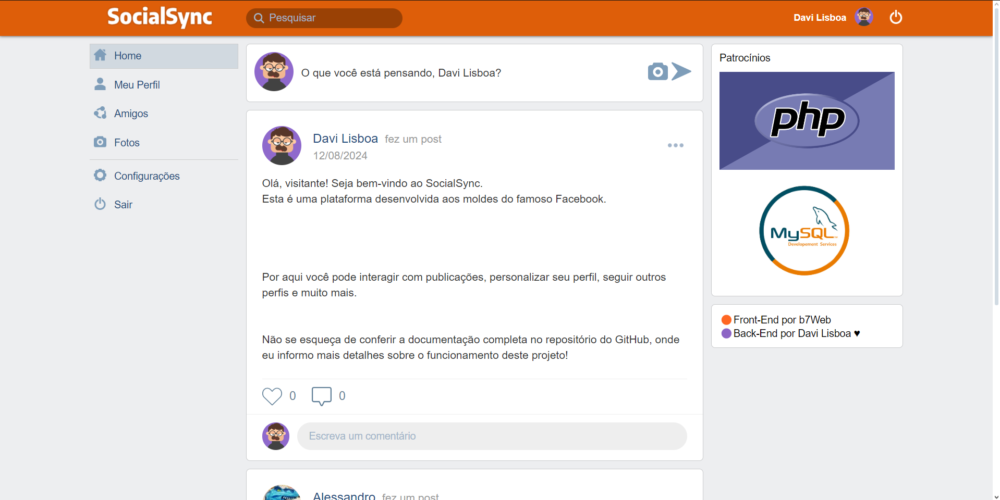

# SocialSync
 Social network project similar to the Facebook platform. Developed in PHP using the MVC design pattern and the MySQL relational database management system. 

## Requirements

- PHP 7.0 or higher
- Web server compatible with PHP (e.g., Apache, Nginx)
- MySQL database
- PDO extension enabled.

## Setup

1. Clone this repository to your local environment:

    `git clone https://github.com/davi-ldf/API_NoteCore.git`


2. Import the `escola_ead.sql` file located in the root of the project in your MySQL database management tool (such as MySQL Workbench, phpMyAdmin, or via command line).

3. Rename the `Config.example.php` file to `Config.php`.

4. Open the `Config.php` file and configure your database credentials:

```php
<?php
$db_host = 'your_host_name';
$db_name = 'socialsync';
$db_user = 'your_user';
$db_pass = 'your_password';

```

## Usage

### Sign In
- Email: user@teste.com
- Password: 123456
  
### Sign Up
- Email: youremail@email.com
- Password: yourpassword

## Features

###User Registration and Login
- Sign up and log in to your account securely.

###Post, Like and Comment
- Share posts, like and comment on others' posts.

###Follow Users 
- Follow other users and view their updates on your feed.

###Profile Custoization
- Customize your profile by changing your name, cover photo, password, location, profession, and more.
  

## Contribution

Contributions are welcome! Feel free to submit pull requests or report issues.

## License

This project is licensed under the MIT License - see the [LICENSE](LICENSE) file for more details.


____________________________________________________________________________________________________________________________________________________________________________________________________________________

### Readme em pt-br

# SocialSync

Projeto de rede social aos moldes da plataforma do Facebook. Desenvolvido em PHP usando o padrão de projeto MVC e o sistema de gerenciamento de banco de dados relacional MySQL.

## Requisitos
- PHP 7.0 ou superior
- Servidor web compatível com PHP (por exemplo, Apache, Nginx)
- Banco de dados MySQL
- Extensão Mysqli habilitada


## Instalação
1. Clone este repositório para seu ambiente local:

    `git clone https://github.com/davi-ldf/API_NoteCore.git`


2. Importe o arquivo `escola_ead.sql` localizado na raiz do projeto no seu gerenciador de banco de dados MySQL (como MySQL Workbench, phpMyAdmin, ou via linha de comando).

3. Renomeie o arquivo `Config.example.php` para `Config.php`.

4. Abra o arquivo `Config.php` e configure suas credenciais de banco de dados:

```php

<?php
$db_host = 'seu_host';
$db_name = 'socialsync';
$db_user = 'seu_usuario';
$db_pass = 'sua_senha';

```

## Uso

### Login
- Usuário: user@teste.com
- Senha: 123456

### Cadastro
- Usuário: seuemail@email.com
- Senha: suasenha

## Funcionalidades

###Cadastro e Login de Usuários 
- Cadastre-se e faça login na sua conta de forma segura.

###Publicar, Curtir, Comentar
- Compartilhe publicações, curta e comente nas publicações de outros usuários.

###Seguir Usuários 
- Siga outros usuários e veja suas atualizações no seu feed.

###Personalização de Perfil
- Personalize seu perfil alterando seu nome, foto de capa, senha, localidade, profissão, e muito mais.


## Contribuição
Contribuições são bem-vindas! Sinta-se à vontade para enviar pull requests ou relatar problemas.

## Licença
Este projeto está licenciado sob a Licença MIT - veja o arquivo [LICENSE](LICENSE) para mais detalhes.
